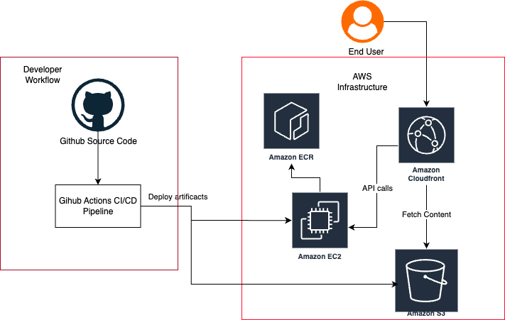

Welcome to the **Intro to Cloud** course! By the end of this workshop, you'll understand key cloud concepts, gain hands-on experience deploying a full stack application to the cloud, 
and confidently discuss terms related to cloud and CICD practices. 

## Welcome to the team!

<iframe width="560" height="315" src="https://www.youtube.com/embed/nhSdljm909Y?si=NxZOxw1pFmM9OX2m" title="YouTube video player" frameborder="0" allow="accelerometer; autoplay; clipboard-write; encrypted-media; gyroscope; picture-in-picture; web-share" referrerpolicy="strict-origin-when-cross-origin" allowfullscreen></iframe>

*Alright! I got something to say!*
Def Leppard has just hired you to join the software team! For their hit song "Rock of Ages" it wasn't enough to make a stellar music video with tight jeans, cute butts, and budget sets. They want to take their hit in a more literal direction and create an application where users can collect actual rocks of the geological type. I guess they are a getting a little tired of sick guitar licks and the fast paced rock star lifestyle. 

In any case, they've already hired a few devs and a project manager to oversee this new venture. The application has been developed by the devs but now they need their rockin' app to be available on the interweb worldwide! You've just been hired as a devops engineer to do just that!

## 📝 Summary

Here's what you'll learn:

- What the **cloud** is (and what it isn't)
- Benefits of cloud computing
- Introduction to major **cloud providers**
- Hands-on experience with **CI/CD**
- How to deploy a **static front-end app** to the cloud
- What is docker 
- Benefits of using docker
- Introduction to **EC2** instances
- How to deploy a **back-end API** to the cloud
- What is **RDS** 
- Benefits of using RDS
- API and Github Actions updates to support RDS
- In-depth work with **Amazon Web Services (AWS)** including:
    - **S3** (Simple Storage Service)
    - **CloudFront** (Content Delivery Network)
    - **EC2** (Elastic Compute Cloud)
    - **ECR** (Elastic Container Registry)
    - **AWS CLI** (Amazon's Command Line Interface)
    - **RDS** (Relational Database Service)

We also offer some additional(optional) content expanding on docker where you'll learn:

- How to set up local testing environment with multiple services
- Introduction to **Docker networking**
- Introduction to **Docker compose**

You’ll build a working vocabulary of cloud-related terms so you can talk tech with confidence.

## The diagram below show our goal: a cloud-powered masterpiece you'll soon command. 🚀

## 🗓️ Course Structure

- **Live Zoom Sessions**: 2 sessions per week, each 2 hours long
- **Slack Channel**: For discussions, announcements 
    - Slack Channel: Join the conversation, ask questions, and stay updated.
    Look for: #cloud-deployment-fundamentals-{your cohort number} — for example, Cohort One = #cloud-deployment-fundamentals-01
- **Session Format**:
  - **Hour 1**: Learn core concepts and collaboratively set up resources in the cloud (instructor-supported)
  - **Hour 2**: Instructor-led walkthroughs, with discussion and deeper insights
- **How to reach us**
  - Got a question? The #help channel on Slack is the perfect place to ask!

---
## 📚 Session Breakdown

There will be Eight class sessions held on Zoom.

#### Session 1: Cloud Fundamentals/Deploying to S3
- What is the Cloud?
- Why Use the Cloud?
- AWS Account Setup
- Overview of the "Rock of Ages" front-end app
- What is S3?
- Hosting Static Sites with AWS S3
- Key Vocabulary

#### Session 2: CloudFront & Content Delivery
- What is CloudFront?
- Configuring CloudFront for performance
- Key Vocabulary

#### Session 3: CI/CD in Action
- Introduction to CI/CD
- CI/CD Fundamentals
- What are GitHub Actions?
- Build a complete deployment pipeline
- Key Vocabulary

#### Session 4: Introduction to Docker
- What is Docker?
- Why Use Docker?
- Run a Docker Container Locally

#### Session 5: AWS CLI and ECR
- AWS CLI setup
- What is ECR?
- Push Docker image to ECR

#### Session 6: Deploying to EC2
- What is EC2?
- Spinning up an EC2 instance
- Pulling Docker image from ECR to EC2
- Running Docker container in EC2

#### Session 7: Expanding on CI/CD
- Different CI/CD workflows and job handling
- GitHub Actions for manual triggers 
- Build a complete deployment pipeline for EC2 

#### Session 8: RDS
- What is RDS?
- Benefits of RDS vs Sqlite
- API updates to support RDS
- Testing RDS using VsCode extensions
- Github actions and secrets updates to deploy RDS compatible API

---

## Course Completion Requirements
- Attendance:  
    - An 80% attendance rate is expected. Students must inform the instructor of any planned absence. 
    - Students who miss two consecutive sessions without prior notification to the instructor will be considered dropped from the course. 
- Final Assessment: one-on-one meeting with an instructor
    - Students will be required to show that they have set up the AWS services covered throughout the course. 
    - Students will answer a few "interview" questions to show that they can discuss what they've learned and use the vocabulary correctly. We are not expecting mastery just a basic understanding of the concepts. 
